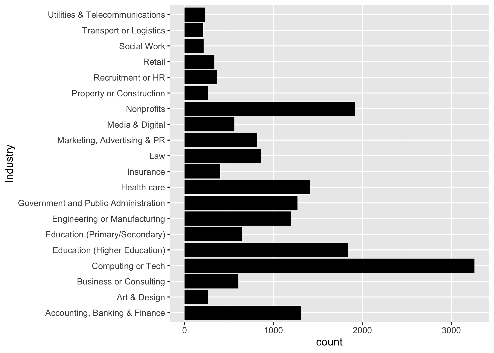

# Summary/Abstract
Salary prediction can be a useful reference tool for people deciding their career. A real-world large dataset pertaining to American job market from OscarBaruffa.com may be utilized to achieve this goal. The dataset contains information such as age, industry name, job title, salary, country, state, years of professional experience, total years of experience, education level, gender, and race, etc. These data can be used for both machine learning and simple linear model construction to predict salary income given the other variables. The dataset was first cleaned to remove observations with problematic entries. Then, the dataset was split into training and testing sets. Machine learning models were tuned and fit to the training set, and the performance results were compared with those of the null model (using mean to predict all) and a simple linear regression model. The results turned out machine learning models did not perform significantly better than the simple linear regression model, but significantly better than the null model.

# Introduction 
Occupation selection is often a tough decision for people when they start to explore potential options for their careers. Many factors would be taken into consideration, such as industry, job title, places, years of experience, education degree, race, and gender, etc. CareerBuilder listed 5 essential factors for determining salaries, which are years of experience and education level, industry, location, in-demand skill sets, and supply and demand [1]. Therefore, in this study, we aimed to use machine learning approach to determine whether we could utilize these factors as predictors to predict for the salary of a job. We aimed to compared different machine learning models to determine which model would perform the best. The machine models being used in this study are: linear model, support-vector machines (SVM), least absolute shrinkage and selection operator (Lasso or LASSO), k-nearest neighbor (knn), decision tree, and random forest. The significance of this study is to offer a trained machine learning model which people may use it as a reference to predict how much salary they would be able to earn based on the information provided. 

## Questions/Hypotheses to be addressed
Machine learning models perform the same as simple linear models for American job salary prediction using the dataset obtained.

# Methods and Results
The original dataset for this study is from OscarBaruffa.com. It is a real-world messy dataset with 26,782 observations and 17 variables before cleaning up. The variables include information such as age, industry name, job title, salary, country, state, years of professional experience, total years of experience, education level, gender, and race, etc. The outcome of interest is salary while the others are used as predictor variables if selected. Since the study is focusing on American job market, only observations with Country “USA”, “US” or “United States” and Currency “USD” are included. Most variables are categorical variables. Some of them are ordinal, such as age group, years of experience, which are categorical in nature but also have comparative order. The only numeric data is the outcome of interest, salary.

The raw dataset was first explored and wrangled to have missing data and abnormal entries removed. Detailed methods are described in Exploratory Analysis. Then, the processed dataset was split into training set and testing set at 7:3 ratio. Different machine learning models were selected and tunned. For model validation, a 5-fold cross-validation was used and repeated for 5 times. The optimal hyperparameters determined during model tunning were selected to fit the training dataset. After model fitting, the model performance was evaluated by root mean square error (RMSE). The model with the smallest RMSE value would be selected to fit the training dataset. The machine models selected were linear model, support-vector machines (SVM), least absolute shrinkage and selection operator (Lasso or LASSO), k-nearest neighbor (knn), decision tree, and random forest. The null model was to use the mean value of the salary column of the training set as the predicting values for all observations. Finally, the performance of the machine learning models were compared with each other as well as the null model.

The null model uses training dataset’s mean value to predict everything and the resulting RMSE is 65,457. Figure 3.1 represents predicting values and the actual values. Figure 3.2 is the residue plot.

Figure \@ref(fig:resultfigure1) shows the predicted values (red) vs actual values (blue) for the null model.
```{r resultfigure1,  fig.cap='Analysis figure2.', echo=FALSE}

```

Figure \@ref(fig:resultfigure2) is the residue plots for the null model.
```{r resultfigure2,  fig.cap='Analysis figure2.', echo=FALSE}

```

For the linear model that used only education level as the single predictor, the RMSE for the model fitting was 64,183. For the linear model that used all variable predictors, the RMSE for the model fitting was 55,931.Figure 3.3 represents predicting values and the actual values for linear model with all predictor variables. Figure 3.4 is the residue plot.

Figure \@ref(fig:resultfigure3) shows the predicted values (red) vs actual values (blue) for the linear model that used all variable predictors.
```{r resultfigure3,  fig.cap='Analysis figure2.', echo=FALSE}

```

Figure \@ref(fig:resultfigure4) is the residue plots for the linear model that used all variable predictors.
```{r resultfigure4,  fig.cap='Analysis figure2.', echo=FALSE}

```

For the decision tree model, the 2 hyperparameters selected to be tuned were cost complexity and tree depth. 5 values of each hyperparameters were tested and it ended up with 5*5 = 25 combinations. Among them, the cost complexity of 0.00000316 with tree depth 15 resulted in the lowest RMSE, which was 58,017. Figure 3.5 represents predicting values and the actual values for linear model with all predictor variables. Figure 3.6 is the residue plot.

Figure \@ref(fig:resultfigure5) shows the predicted values (red) vs actual values (blue) for the decision tree model.
```{r resultfigure5,  fig.cap='Analysis figure2.', echo=FALSE}

```

Figure \@ref(fig:resultfigure6) is the residue plots for the decision tree model.
```{r resultfigure6,  fig.cap='Analysis figure2.', echo=FALSE}

```

For the random forest model, the 2 hyperparameters selected to be tuned were “mtry” (an integer for the number of predictors that will be randomly sampled at each split when creating the tree models) and “min_n” (an integer for the minimum number of data points in a node that are required for the node to be split further) [2]. 5 values of each hyperparameters were tested and it ended up with 5*5 = 25 combinations. Among them, the “mtry” of value 12 with “min_n” value 37 resulted in the lowest RMSE, which was 55,790. Figure 3.7 represents predicting values and the actual values for linear model with all predictor variables. Figure 3.8 is the residue plot.

Figure \@ref(fig:resultfigure7) shows the predicted values (red) vs actual values (blue) for the random forest model.
```{r resultfigure7,  fig.cap='Analysis figure2.', echo=FALSE}

```

Figure \@ref(fig:resultfigure8) is the residue plots for the random forest model.
```{r resultfigure8,  fig.cap='Analysis figure2.', echo=FALSE}

```

For the SVM model, the 2 hyperparameters selected to be tuned were cost (a positive number for the cost of predicting a sample within or on the wrong side of the margin) and “rbf_sigma” (a positive number for radial basis function) [3]. A variety of combinations of the 2 hyperparameters were tested. Among them, the cost of value 0.415 with “rbf_sigma” value 0.832 resulted in the lowest RMSE, which was 66,191. Figure 3.9 represents predicting values and the actual values for linear model with all predictor variables. Figure 3.10 is the residue plot.

Figure \@ref(fig:resultfigure9) shows the predicted values (red) vs actual values (blue) for the SVM model.
```{r resultfigure9,  fig.cap='Analysis figure2.', echo=FALSE}

```

Figure \@ref(fig:resultfigure10) is the residue plots for the SVM model.
```{r resultfigure10,  fig.cap='Analysis figure2.', echo=FALSE}

```

For the KNN model, the only hyperparameter selected to be tuned was “neighbors” (a single integer for the number of neighbors to consider) [4]. A variety of the hyperparameters (k=1 to 200 at an increment of 3) were tested. Among them, the “neighbors” of value 25 resulted in the lowest RMSE, which was 57,981. Figure 3.11 represents predicting values and the actual values for linear model with all predictor variables. Figure 3.12 is the residue plot.

Figure \@ref(fig:resultfigure11) shows the predicted values (red) vs actual values (blue) for the KNN model.
```{r resultfigure11,  fig.cap='Analysis figure2.', echo=FALSE}

```

Figure \@ref(fig:resultfigure12) is the residue plots for the KNN model.
```{r resultfigure12,  fig.cap='Analysis figure2.', echo=FALSE}

```

For the LASSO model, the only hyperparameter selected to be tuned was “penalty” (A non-negative number representing the total amount of regularization) [5]. A variety of the hyperparameters (penalty = 10^seq(-4,-1)) were tested. Among them, the “penalty” of value 0.0001 resulted in the lowest RMSE, which was 55,445. Figure 3.13 represents predicting values and the actual values for linear model with all predictor variables. Figure 3.14 is the residue plot.

Figure \@ref(fig:resultfigure13) shows the predicted values (red) vs actual values (blue) for the LASSO model.
```{r resultfigure13,  fig.cap='Analysis figure2.', echo=FALSE}

```

Figure \@ref(fig:resultfigure14) is the residue plots for the LASSO model.
```{r resultfigure14,  fig.cap='Analysis figure2.', echo=FALSE}

```

Linear model with all predictor variables was selected to perform the final fit of the testing dataset, and it resulted in an RMSE value of 46,934. In comparison, the null model resulted in an RMSE value of 57,219.


## Data import and cleaning
See processingscript.R file in code/processingz-code directory. Briefly, after loaded the data from the xls file, data related to United States were extracted (Country = US and Currency = USD). Then, since very few rows contains NA entry, these rows are removed from the dataset. Then, for each variable was plotted to see their structure. Most of them only contains a few entry types and are ready to go, while some variables contain messy text entries that have to be cleaned up. For the industry column, only the top 20 industries was picked since only top 20 industries contain enough data for model training and testing. For the job title text entry, it was too messy to clean up since people may call a same position with different names. Therefore, this variable was dropped. Observations with salary values less than $10,000 were also left out, since it is very unlikely. For the variable race, around 95% of entry are white, and since this variable has little variation, it was dropped from the analysis as well. 


## Exploratory analysis

First, the raw dataset was imported into R Studio. Some of the column names were renamed to be more straightforward and concise, such as age, job, salary, and education, etc. Since this study concentrates on US domestic job markets, only observations whose country is United States and that were paid in US dollars were selected for the analysis.  For variable selection, age, industry, job title, salary, state, years of professional experience, years of total experience, education, gender, and race were selected to be explored to see the data structure. The data distribution of each variable was evaluated to see whether the data were cleanable and contained sufficient variation. If any variable is found to be messy, a clean-up process would be initiated. If success, the variable would be retained in the analysis. Otherwise, it would be excluded. If a variable contains little variation, it would be excluded as well. 

After the general data cleaning process was done, some further processing was performed. Any observation with any missing data (“NA” entry) was removed from the dataset. Some data entries had unreasonable numeric values, and was therefore excluded from the dataset. For instance, an annual salary smaller than $10,000 was considered highly likely to be a parttime job and was eliminated from the dataset. Moreover, for some variables, there are entries whose occurrence number was too small to be useful for machine learning model training. Therefore, these data were also excluded from the dataset. For example, for the variable “age”, the occurrence number for age under 18 is close to 0. The presence of this group would cause an error during model training. Therefore, any observations with age under 18 were removed. The variable “race” contains little data variation as over 95% of population are from the same group. It was thus dropped from the selected variables. 

There are some variables whose entries are free text, such as industry and job title. For the variable industry, the text entries were messy and there were over a hundred types of entries. Most of these entries only appears once or a few times and thus they could not be used for machine learning purpose. However, after summarizing this variable data and putting them in the order of occurrence number, we found the top 20 occurrence entries covered most and sufficient data in the dataset (17,942 out of 26,782). Therefore, for this study, only the top 20 entries of the variable industry were selected (Figure 15.). Another reason only the top 20 entries for the variable industry was selected is that the top 20 entries have sufficient data for training and testing dataset splitting and model training. For the variable job title, we found many entries were actually close in meaning but slightly different in wording. It is technically quite difficult to parse these entries and turn them into one category. Therefore, for this reason, we would rather not to incorporate this variable with messy entries that were too difficult to clean up. 

In short, the final 7 predictor variables we selected for analysis are age, industry name (top 20 entries from original dataset), state, years of professional experience, total years of experience, education level and gender. Some entries of these variables were removed from the dataset due to not having sufficient data for model training. The outcome of interest is salary in US dollar.

Figure \@ref(fig:resultfigure15) shows the entries for the variable Industry after clean-up.
```{r resultfigure15,  fig.cap='Analysis figure2.', echo=FALSE}

```

More detailed exploratory analyses are in Supplementary Materials.

## Full analysis
Full analysis R script is in code/analysis_code/analysisscript.html

# Discussion
From the results above, most models perform similarly in terms of RMSE value except for the SVM model and the null model. Decision tree model, linear model with all predictor variables, random forest, KNN, and LASSO all performed better than the null model, as these models were able to reduce the RMSE value of the null model by around 20%. Among these 5 models, the linear model with all predictor variables is the simplest model and is therefore more favored. The results of this study demonstrate machine learning models may not perform significantly better than simple linear models.

In terms of possible improvements for model performance, more model tuning could have been performed to determine to optimal hyperparameters values. On the other hand, from the data side, some original data excluded from this analysis such as job title could have been cleaned up in some way to incorporate them as a predictor variable. We simply removed this variable. This definitely resulted in some information loss.

## Strengths and Limitations
The strength of this study lies in testing 5 machine learning models, which covers at least around half of the most common machine learning models for regression. The limitation of the study would be handling of free-text data. For instance, we were not able to incorporate job title as a predictor variable due to people calling similar or the same job differently. This leads to some information loss that could have been useful to improve model performance. Moreover, for the linear model, variable selection could have been performed in a more delicate way than this study, which simply tested a single-variable model and a full-variable model. In the full-variable model, some variables were clearly highly correlated, such as years of total working experience, years of professional working experience, and age. It is possible that some of these variables could have been dropped to form a simpler model with comparable performance.

## Conclusions
Complex machine learning models may not necessarily perform significantly better than simple linear models. The optimal choice depends on specific dataset.

# References
[1] 5 essential factors for determining compensation. (n.d.). Retrieved November 24, 2021, from https://resources.careerbuilder.com/recruiting-solutions/how-to-build-employee-compensation-programs

[2] Random forest—Rand_forest. (n.d.). Retrieved November 29, 2021, from https://parsnip.tidymodels.org/reference/rand_forest.html

[3] Radial basis function support vector machines—Svm_rbf. (n.d.). Retrieved November 29, 2021, from https://parsnip.tidymodels.org/reference/svm_rbf.html

[4] K-nearest neighbors—Nearest_neighbor. (n.d.). Retrieved November 29, 2021, from https://parsnip.tidymodels.org/reference/nearest_neighbor.html

[5] Linear regression—Linear_reg. (n.d.). Retrieved November 29, 2021, from https://parsnip.tidymodels.org/reference/linear_reg.html


