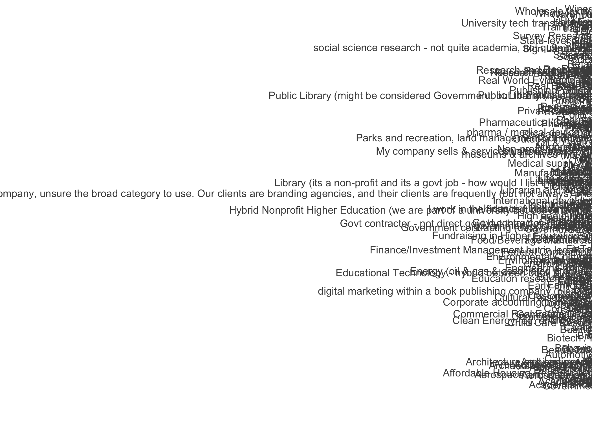

# Summary/Abstract
_Write a summary of your project._


# Introduction 

The dataset I obtained is about jobs and salaries. The dataset contains variables including: 
- age group
- industry
- job title
- salary
- country
- state
- years of professional experience
- total years of experience
- education level
- gender
- race

Most variables are categorical variables. Some of them are ordinal, such as age group, years of experience, which are categorical in nature but also have comparative order. The only numeric data is the outcome of interest, which is salary.

dataset source: https://oscarbaruffa.com/messy/

## Questions/Hypotheses to be addressed

- Is it possible to predict a job's salary based on the variables mentioned above?
- What are the major determinants of a job's salary? Is there a good model summarizing the dataset?


# Methods and Results


## Data import and cleaning
See processingscript.R file in code/processingz-code directory. Briefly, after loaded the data from the xls file, data related to United States were extracted (Country = US and Currency = USD). Then, since very few rows contains NA entry, these rows are removed from the dataset. Then, for each variable, I did some plotting to see its structure. Most of them only contains a few entry types and are ready to go, while some variables contain messy text entries that have to be cleaned up. For the industry column, I picked the top 20 industries since only top 20 industries have enough datapoints for model training and testing. For the job title text entry, it is too messy to clean up since people may call a same position with different names. Therefore, this variable is dropped. I filtered out observations where salary values are less than $10,000, since it is very unlikely. For the variable race, around 95% of entry are white. Since this variable has little variation, it is dropped from the analysis too. 


## Exploratory analysis

Most of the EPA is in code/processing_code/processingscript.html

Below is how I handled messy text entry for the variable Industry

Figure \@ref(fig:resultfigure1) shows the messy data structure for the variable Industry before clean-up.

```{r resultfigure1,  fig.cap='Analysis figure1.', echo=FALSE}

```

Figure \@ref(fig:resultfigure2) shows the data structure for the variable Industry after clean-up.
```{r resultfigure2,  fig.cap='Analysis figure2.', echo=FALSE}
knitr::include_graphics("../../results/resultfigure2.png")
```


## Full analysis
Full analysis is in code/analysis_code/analysisscript.html

I divided the cleaned dataset (~8000 observations) into 75% training set and 25% testing set.
So far, I tried the general linear model with single predictor of interest (education) and all predictors. After that, I compared the 2 models with the null model, which is using the mean value to predict everything. Finally, rmse is calulated for the 3 models.

The result shows the rmse values for single predictor model, the full predictor model, and the null model are 56588, 48222, and 58012. The 2 models are both slightly more accurate models than the null model. 


# Discussion

## Summary and Interpretation
_Summarize what you did, what you found and what it means._

## Strengths and Limitations
_Discuss what you perceive as strengths and limitations of your analysis._

## Conclusions
_What are the main take-home messages?_

# References


