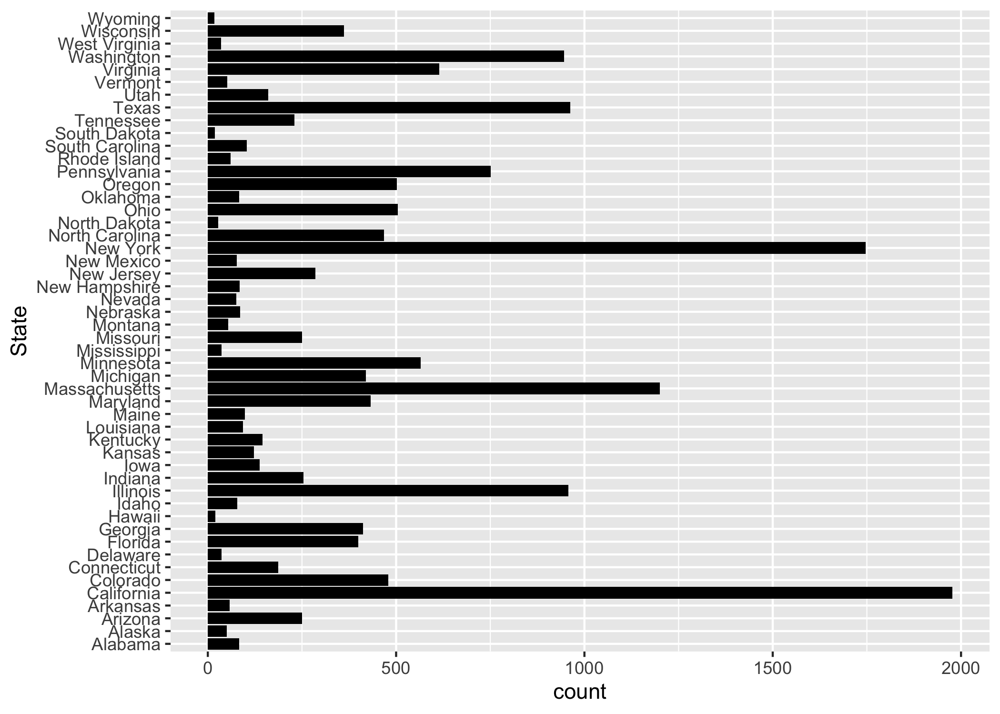
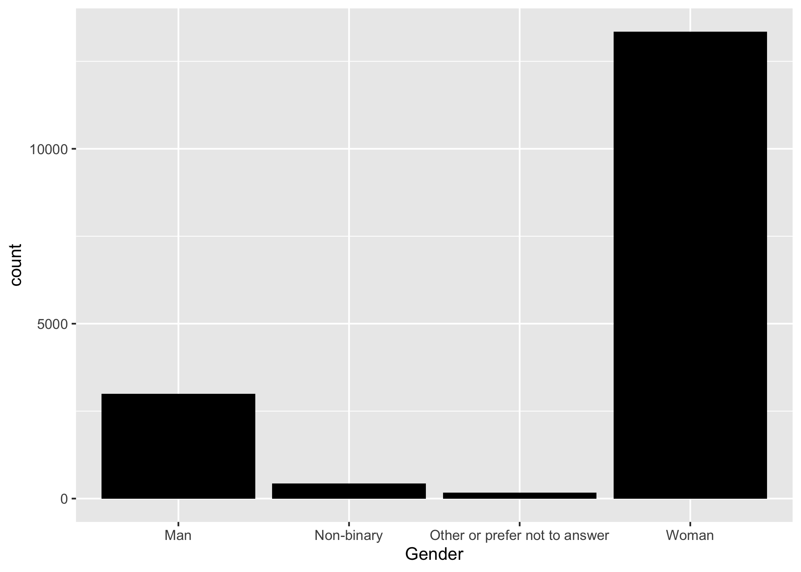

# Exploratory Analysis Details

We are only interested in data from US. We first filter out all American data (Country = USA/United States, Currency = USD)

Figure \@ref(fig:resultfigure1) shows the remaining country entries are USA only after clean up, regardless of upper or lower cases.
```{r resultfigure1,  fig.cap='Analysis figure1.', echo=FALSE}

```

Figure \@ref(fig:resultfigure2) shows the remaining currency entries are USD only after clean up.
```{r resultfigure2,  fig.cap='Analysis figure2.', echo=FALSE}

```

Figure \@ref(fig:resultfigure3) shows the original age data before clean up.
```{r resultfigure3,  fig.cap='Analysis figure3.', echo=FALSE}

```
As shown above, the age entries are divided into 7 groups, we have to remove 2 groups with almost no datapoints since they do not contain enough data for model training.

Figure \@ref(fig:resultfigure4) shows the age data after clean up.
```{r resultfigure4,  fig.cap='Analysis figure4.', echo=FALSE}

```

Figure \@ref(fig:resultfigure5) shows the original job title data.
```{r resultfigure5,  fig.cap='Analysis figure5.', echo=FALSE}

```
As shown above, the job title entries are too messy to clean up. We just drop this column for simplicity. 

Figure \@ref(fig:resultfigure6) shows the original industry data before clean up.
```{r resultfigure6,  fig.cap='Analysis figure6.', echo=FALSE}
knitr::include_graphics("../../results/resultfigure1.png")
```
As shown above, the industry entries are messy. However, different from the job title data, most entries are among the top 20 occurrence. Therefore, we extract top 20 industries. Moreover, all top 20 industries have enough data for model training. Therefore, we choose to drop the rest.

Figure \@ref(fig:resultfigure7) shows the industry data after clean up.
```{r resultfigure7,  fig.cap='Analysis figure7.', echo=FALSE}
knitr::include_graphics("../../results/resultfigure2.png")
```

Figure \@ref(fig:resultfigure8) shows the original state data before clean up.
```{r resultfigure8,  fig.cap='Analysis figure8.', echo=FALSE}
knitr::include_graphics("../../results/resultfigure3.png")
```
As shown above, the state entries are messy too. We have to filter out the 50 states.

Figure \@ref(fig:resultfigure9) shows the state data after clean up.
```{r resultfigure9,  fig.cap='Analysis figure9.', echo=FALSE}

```

Figure \@ref(fig:resultfigure10) shows the original years of professional experience data before clean up.
```{r resultfigure10,  fig.cap='Analysis figure10.', echo=FALSE}

```
As shown above, the entries "41 years or above" have few datapoints and do not contain enough data for model training. Thus, we have to drop them.

Figure \@ref(fig:resultfigure11) shows the years of professional experience data after clean up.
```{r resultfigure11,  fig.cap='Analysis figure11.', echo=FALSE}

```

Similarly, we do the same thing for "years of total experience".
Figure \@ref(fig:resultfigure12) shows the original years of total experience data before clean up.
```{r resultfigure12,  fig.cap='Analysis figure12.', echo=FALSE}

```
As shown above, the entries "41 years or above" have few datapoints and do not contain enough data for model training. Thus, we have to drop them.

Figure \@ref(fig:resultfigure13) shows the years of total experience data after clean up.
```{r resultfigure13,  fig.cap='Analysis figure13.', echo=FALSE}

```

Figure \@ref(fig:resultfigure14) shows the original education data, which are decent and do not need clean-up.
```{r resultfigure14,  fig.cap='Analysis figure14.', echo=FALSE}

```

Figure \@ref(fig:resultfigure15) shows the original race data, which show little variation.
```{r resultfigure15,  fig.cap='Analysis figure15.', echo=FALSE}

```
As shown above, the entries are mostly "white" and contains little variation. Therefore, this variable should be dropped.

Figure \@ref(fig:resultfigure16) shows the original gender data before clean up.
```{r resultfigure16,  fig.cap='Analysis figure16.', echo=FALSE}

```
As shown above, the entries "Other or prefer not to answer" have few datapoints and do not contain enough data for model training. Thus, we have to drop them.

Figure \@ref(fig:resultfigure17) shows the gender data after clean up.
```{r resultfigure17,  fig.cap='Analysis figure17.', echo=FALSE}
knitr::include_graphics("../../results/resultfigure17.png")
```
